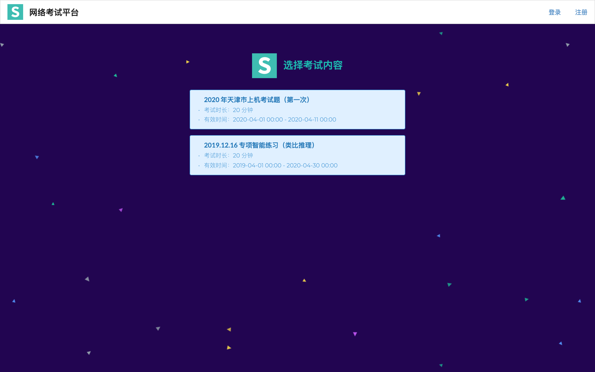
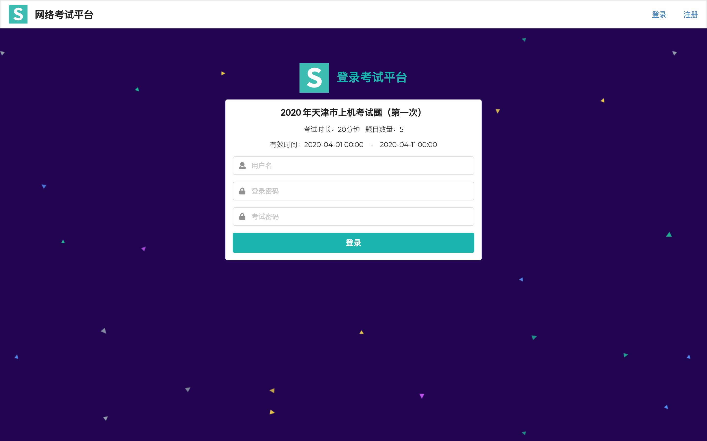
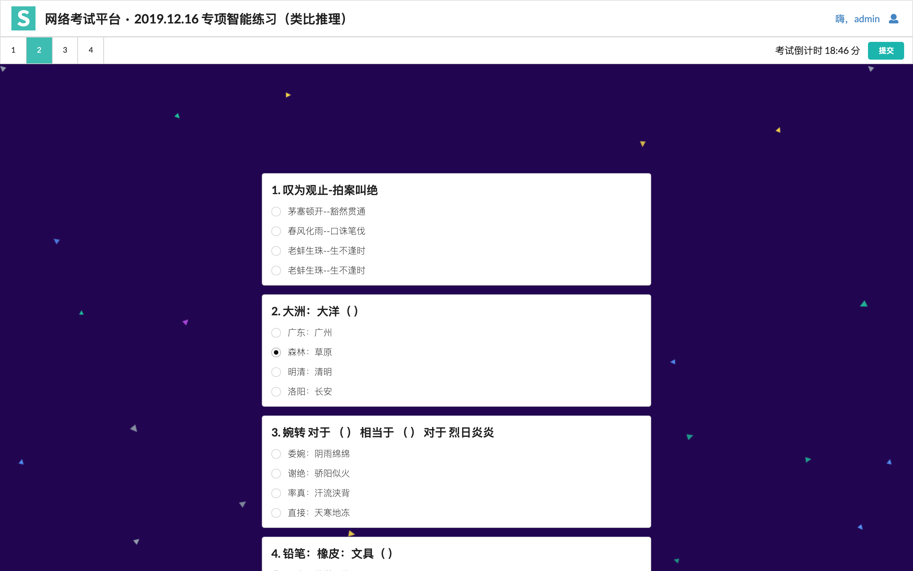
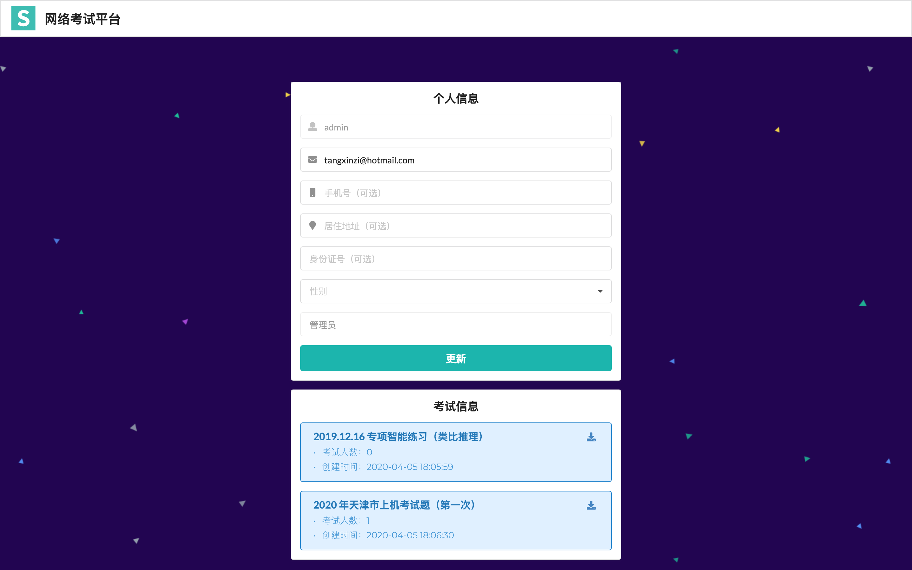

<h1 align="center">网络考试平台</h1>
应用依赖的是 Adonis.Js 框架，Adonis.Js 是一个可以运行在所有主流操作系统上的 Node.Js MVC 框架。程序使用 MySQL 数据库，请在 .env 文件中配置数据库参数，另外还需安装 Redis 缓存本地数据使用。

该应用前端主要展示以下功能
----

- 形成若干套试题套卷
- 学生答题并提交试卷
- 试卷提交后即打印相应分数，下载 `Excel` 表格
- 管理员管理学生信息及考试成绩
- 注册、更新账号信息






后端
---

- 管理员管理考试用卷套数
- 管理员添加考生参与指定的考试，已被指定参与考试的学生方能进入考试
- 后台可以对账号进行管理

项目下载和运行
---

拉取项目代码
```
git clone https://github.com/Tangxinzi/token-adonis.git
cd token-adonis
```

安装依赖
```
yarn install
```

运行 `redis` 数据库
```
redis-server
```

开发模式运行
```
cp .env.example .env
adonis key:generate
adonis serve --dev
→ info: serving app on http://127.0.0.1:3333
```

如果提示没有找到 `adonis` 命令，您需要先去安装一下。
```
npm install @adonisjs/cli --global
```

.env 文件配置本地访问及开发端口，使用 MySQL 另需配置 DB 参数数据。
```
HOST=127.0.0.1
PORT=3333
NODE_ENV=development
APP_URL=http://${HOST}:${PORT}
BASE_URL=http://${HOST}:8888
CACHE_VIEWS=false
APP_KEY=eAtHToKUZnAE1GSzu42xqTuKWlqGTiJx

DB_CONNECTION=mysql
DB_HOST=127.0.0.1
DB_PORT=3306
DB_USER=root
DB_PASSWORD=12345678
DB_DATABASE=exam
SESSION_DRIVER=cookie
```
